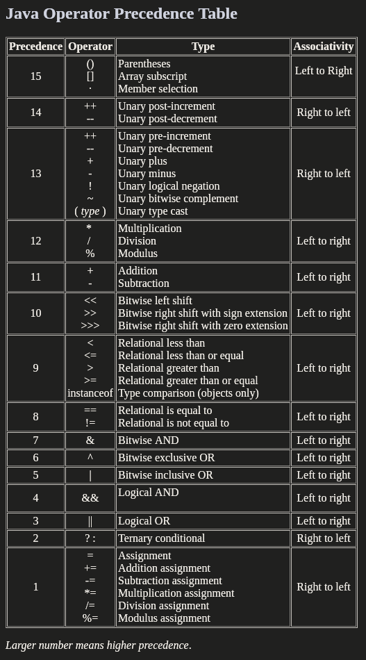

# Complete Java Masterclass Notes

[**Udemy Course Link**](https://www.udemy.com/java-the-complete-java-developer-course/learn/v4/content) - https://www.udemy.com/java-the-complete-java-developer-course/learn/v4/content

[**IntelliJ IDEA**](http://www.jetbrains.com/idea/download/#section=linux) - http://www.jetbrains.com/idea/download/#section=linux


## Table of Contents

Lecture Topic | Link
--- | ---
**SECTION 2** | [**Section 2**](#section-2)
Installing Java Development Kit (JDK) For Ubuntu Linux | [Lecture 9](#section-2-lecture-9)
Install and Configure IntelliJ Ubuntu Linux | [Lecture 10](#section-2-lecture-10)
**SECTION 3** | [**Section 3**](#section-3)
Creating Your First Java Project | [Lecture 13](#section-3-lecture-13)
**SECTION 4** | [**Section 4**](#section-4)
What Are Variables? | [Lecture 16](#section-4-lecture-16)
Getting to Know Primitive Data Types - The Bytte, Short, Int and Long | [Lecture 17](#section-4-lecture-17)
Getting to Know Primitive Data Types - Float and Double | [Lecture 18](#section-4-lecture-18)
Getting to Know Primitive Data Types - Char and Boolean | [Lecture 19](#section-4-lecture-19)
Understanding Strings and Finishing Up Primitive Data Types | [Lecture 20](#section-4-lecture-20)
Operators in Java | [Lecture 21](#section-4-lecture-21)

<!-- ################################################################################################################ -->
<!--                                                     SECTION 2                                                    -->
<!-- ################################################################################################################ -->

## SECTION 2

### Section 2 Lecture 9

- **Add The Java Repo** - `sudo add-apt-repository ppa:webupd8team/java`
- **Installing Java Development Kit** - `sudo apt-get install oracle-java8-installer`
- **Update Java Developemnt Kit** - `sudo update-alternatives --config java`
- **Check to Make Sure Install Was Successful** - `java -version`

### Section 2 Lecture 10

- **CD into IntelliJ IDEA DIR > bin** - `cd idea-IU-173.4674.33/bin`
- **Execute idea.sh to launch IntelliJ** - `./idea.sh`

#### Configure IntelliJ

- Click **Configure** > **Project Defaults** > **Project Structure** > Find the installed **Project SDK** > click **ok**
- Click **Configure** > **Settings** > **Editor** > **General** > **Auto Import** and Enable **Add unambiguous imports on the fly** and **Optimize imports on the fly (for current project)** > click **ok**

<!-- ################################################################################################################ -->
<!--                                                     SECTION 3                                                    -->
<!-- ################################################################################################################ -->

## SECTION 3

### Section 3 Lecture 13

- **Hello World**

```java
public class Hello {
    public static void main(String[] args) {
        System.out.println("Hello World!");
    }
}
```


<!-- ################################################################################################################ -->
<!--                                                     SECTION 3                                                    -->
<!-- ################################################################################################################ -->

## SECTION 4

### Section 4 Lecture 16

- **Variables**

```java
public class Hello {
    public static void main(String[] args) {
        System.out.println("Hello World!");

        int myFirstNumber = (5 + 5) + (2 * 10);
        int mySecondNumber = 12;
        int myThirdNumber = myFirstNumber * 2;

        int myTotal = myFirstNumber + mySecondNumber + myThirdNumber;

        int myLastOne = 1000 - myTotal;

        System.out.println(myLastOne);
    }
}
```

### Section 4 Lecture 17

#### Notes

- **literal** - A literal is a raw value that is typed such as 1234, rather (a * b) is an **expression**
- **2_147_483_647** - Since Java 7 underscores between number sets is supported
- ``byte`` has a width of **8**
- ``short`` has a width of **16**
- ``int`` has a width of **32**
- ``long`` has a width of **64** and it's value **SHOULD** end with either l (lower case L) or L to signify that it is a ``long``
- ``long`` type supports ``int`` type the following expression does **NOT** require casting:

```java
long myValidLongTotal = 50_000L + 10L * (myValidByteNumber + myValidShortNumber + myValidIntNumber);
```

#### Number Data Types

- **byte** - Used to store value ranging from -128 to 127
- **short** - Used to store value ranging from -32768 to 32767
- **int** - Used to store values ranging from -2147483648 to 2147483647
- **long** - Used to store values ranging from -9_223_372_036_854_775_808L to 9_223_372_036_854_775_807L

```java
package com.byteShortInt;

public class Main {

    public static void main(String[] args) {

        // byte has a width of 8
        byte myMinByteValue = -128;
        byte myMaxByteValue = 127;

        // short has a width of 16
        short myMinShortValue = -32768;
        short myMaxShortValue = -32767;

        // int has a width of 32
        int myMinIntValue = -2_147_483_648;
        int myMaxIntValue = 2_147_483_647;

        // long has a width of 64
        long myMinLongValue = -9_223_372_036_854_775_808L;
        long myMaxLongValue = 9_223_372_036_854_775_807L;
    }
}
```

#### Casting

When trying to perform an expression such as 

```java
int myTotalIntValue = (myMinIntValue/2)
```

Java will convert the values inside the expression to ``int`` by default. When preforming a calculation such as \

```java
byte myTotalByteValue = (myMinByteValue/2)
```

this will result in a hard error as Java is trying to assign a ``int`` value to ``byte`` variable. To get around this, you must tell Java to treat the expression ``(myMinByteValue/2)`` as a ``byte`` like so:

```Java
byte myTotalByteValue = (byte) (myMinByteValue/2);
```

### Section 4 Lecture 18

#### Notes

- Denote ``float`` number like so: ``float myFloatValue = 5.5f`` (you can also use ``(float)`` casting)
- Denote ``double`` number like so: ``double myDoubleValue = 5.5d`` (you can also use ``(double)`` casting)
- The width of `float` is 32 (bytes)
- The width of `double` is 64 (8 bytes)
- You can also put ``_`` in decimals e.g. ``0.453_592_37d``

#### Number Data Types

- **Float** - Used to store numbers up to **7 decimal places**
- **Double** - Used to store numbers up to **16 decimal places**

```java
package com.floatAndDouble;

public class Main {

    public static void main(String[] args) {
        // width of int = 32 (4 bytes)
        int myIntValue = 5 / 3;

        // width of float = 32 (4 bytes)
        float myFloatValue = 5f / 3f;

        // width of double = 64 (8 bytes)
        double myDoubleValue = 5d / 3d;
    }
}
```

### Section 4 Lecture 19

#### Notes

- ``char`` has a width of **16 (2 bytes)**

#### Data Types

- **char** - Used to store a single character or unicode character
- **boolean** - Used to store ``true`` or ``false``

```java
package com.charAndBoolean;

public class Main {

    public static void main(String[] args) {
        // width of 16 (2 bytes)
        char myChar= 'A';
        System.out.println("myChar " + myChar);

        // char supports unicode characters using the \u prefix
        char myUnicodeChar= '\u00A9';
        System.out.println("myUnicodeChar " + myUnicodeChar);

        boolean myBoolean = false;
    }
}
```

### Section 4 Lecture 20

```java
package com.strings;

public class Main {

    public static void main(String[] args) {
        String myString = "This is a string";
        System.out.println("myString is equal to " + myString);
        // Outputs: myString is equal to This is a string

        myString = myString + ", and this is more.";
        System.out.println("myString is equal to " + myString);
        // Outputs: myString is equal to This is a string, and this is more.

        myString = myString + " \u00A9 2015";
        System.out.println("myString is equal to " + myString);
        // Outputs: myString is equal to This is a string, and this is more. © 2015

        String numberString = "250.55";
        numberString = numberString + "49.95";
        System.out.println("The result is " + numberString);
        // Outputs: The result is 250.5549.95

        String lastString = "10";
        int myInt = 50;
        lastString = lastString + myInt;
        System.out.println("LastString is equal to " + lastString);
        // Outputs: LastString is equal to 1050

        double doubleNumber = 120.47;
        lastString = lastString + doubleNumber;
        System.out.println("LastString value: " + lastString);
        // Outputs: LastString value: 1050120.47
    }
}
```

### Section 4 Lecture 21

#### Java Operator Precendence Table
[**Java Operator Precendence Table**](http://cs.bilkent.edu.tr/~guvenir/courses/CS101/op_precedence.html) - http://cs.bilkent.edu.tr/~guvenir/courses/CS101/op_precedence.html



#### Operators

##### Simple Assignment Operator

- **=** - Simple assignment operator

##### Arithmetic Operators

- **+** - Additive operator (also used for String concatenation)
- **-** - Subtraction operator
- **\*** - Multiplication operator
- **/** - Division operator
- **%** - Remainder operator

##### Unary Operators

- **+** - Unary plus operator; indicates positive value (numbers are positive without this, however)
- **-** - Unary minus operator; negates an expression
- **++** - Increment operator; incrementsa value by 1
- **--** - Decrement operator; decrements a value by 1
- **!** - Logical complement operator; inverts the value of a boolean

##### Equality and Relational Operators

- **==** - Equal to
- **!=** - Not equal to
- **>** - Greater than
- **>=** - Greater than or equal to
- **<** - Less than
- **<=** - Less than or equal to

##### Conditional Operators

- **&&** - Conditional-AND
- **||** - Conditional-OR
- **?:** - Ternary (shorthand for if-then-else statement)

##### Type Comparison Operator

- **instanceof** - Compares an object to a specified type 

##### Bitwise and Bit Shift Operators

- **~** - Unary bitwise complement
- **<<** - Signed left shift
- **>>** - Signed right shift
- **>>>** - Unsigned right shift
- **&** - Bitwise AND
- **^** - Bitwise exclusive OR
- **|** - Bitwise inclusive OR
